AndroidZdog

Porting [Zdog](https://zzz.dog/)(Round, flat, designer-friendly  pseudo-3D engine for canvas) to Android with kotlin

## Table of content
- [Getting started](#getting-started)
  - [Gradle](#gradle)
  - [Maven](#maven)
- [What can it do?](#What-can-it-do?)
  - [The basic shapes](#The-basic-shapes)
  - [The dynamic icons](#The-dynamic-icons)
  - [More complex graphics and animations](#More-complex-graphics-and-animations)
- [Usage](#usage)
  - [Contrast with Zdog](#Contrast-with-Zdog)
  - [Display shapes in ImageView](#Display-shapes-in-ImageView)
- [Extended features](#Extended-features)
  - [Segment](#Segment)
  - [Path Effect](#Path-Effect)
  - [Gradient](#Gradient)
  - [Shadow](#Shadow)
  - [Path Animation](#Path-Animation)
  - [Real-time update path](#Real-time-update-path)

## Getting started

#### Gradle

**Step 1.** Add the JitPack repository to your build file

Add it in your root build.gradle at the end of repositories:

```groovy
	allprojects {
		repositories {
			...
			maven { url 'https://jitpack.io' }
		}
	}
```

**Step 2.** Add the dependency

```groovy
	dependencies {
	        implementation 'com.github.prostory:AndroidZdog:v1.0.0'
	}
```

#### Maven

**Step 1.** Add the JitPack repository to your build file

```xml
	<repositories>
		<repository>
		    <id>jitpack.io</id>
		    <url>https://jitpack.io</url>
		</repository>
	</repositories>
```

**Step 2.** Add the dependency

```xml
<dependency>
	    <groupId>com.github.prostory</groupId>
	    <artifactId>AndroidZdog</artifactId>
	    <version>Tag</version>
	</dependency>
```

## What can it do?

#### Simple graphics and animation

|          Basic Shapes          |          Extended Features          |          Dynamic icons          |
| :----------------------------: | :---------------------------------: | :-----------------------------: |
| 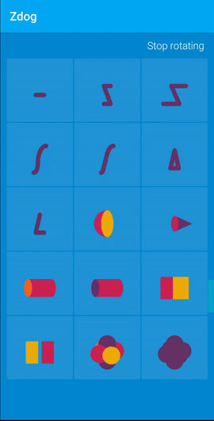 | 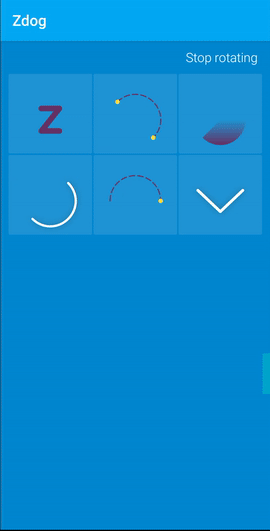 |  |

#### More complex graphics and animations

|          Day          |          Night          |          Rotate          |
| :-------------------: | :---------------------: | :----------------------: |
| 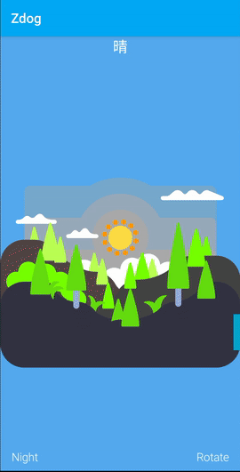 |  | 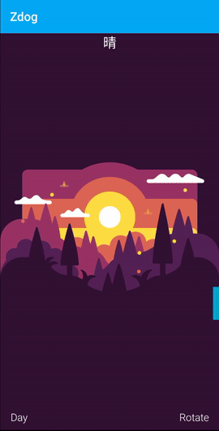 |

## Usage

#### Contrast with Zdog

- Line

  - For Zdog

    ```javascript
    // line
    new Zdog.Shape({
      addTo: illo,
      path: [
        { x: -40 }, // start at 1st point
        { x:  40 }, // line to 2nd point
      ],
      stroke: 20,
      color: '#636',
    });
    ```

    ```javascript
    // z-shape
    new Zdog.Shape({
      addTo: illo,
      path: [
        { x: -32, y: -40 }, // start at top left
        { x:  32, y: -40 }, // line to top right
        { x: -32, y:  40 }, // line to bottom left
        { x:  32, y:  40 }, // line to bottom right
      ],
      closed: false,
      stroke: 20,
      color: '#636',
    });
    ```

    ```javascript
    // 3D shape
    new Zdog.Shape({
      addTo: illo,
      path: [
        { x: -32, y: -40, z:  40 },
        { x:  32, y: -40 },
        { x:  32, y:  40, z:  40 },
        { x:  32, y:  40, z: -40 },
      ],
      closed: false,
      stroke: 20,
      color: '#636',
    });
    ```

  - For AndroidZdog

    ```kotlin
    // line
    shape {
        addTo = illo
        path(
            move(x = -40f), // start at 1st point
            line(x = 40f)   // line to 2nd point
        )
        stroke = 20f
        color = "#636"
    }
    ```

    ```kotlin
    // z-shape
    shape {
        addTo = illo
        path(
            move(x = -32f, y = -40f), // start at top left
            line(x = 32f, y = -40f),  // line to top right
            line(x = -32f, y = 40f),  // line to bottom left
            line(x = 32f, y = 40f)    // line to bottom right
        )
        closed = false
        stroke = 20f
        color = "#636"
    }
    ```

    ```kotlin
    // 3D shape
    shape {
        addTo = illo
        path(
            move(x = -32f, y = -40f, z = 40f),
            line(x = 32f, y = -40f),
            line(x = 32f, y = 40f, z = 40f),
            line(x = 32f, y = 40f, z = -40f)
        )
        closed = false
        stroke = 20f
        color = "#636"
    }
    ```

  - Shapes

    |           line            |          z-shape          |         3D shape          |
    | :-----------------------: | :-----------------------: | :-----------------------: |
    | 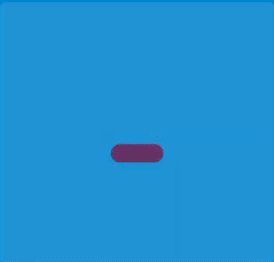 |  | 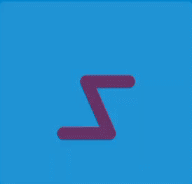 |

- Arc

  - For Zdog

    ```javascript
    new Zdog.Shape({
      addTo: illo,
      path: [
        { x: -60, y: -60 },   // start
        { arc: [
          { x:  20, y: -60 }, // corner
          { x:  20, y:  20 }, // end point
        ]},
        { arc: [ // start next arc from last end point
          { x:  20, y:  60 }, // corner
          { x:  60, y:  60 }, // end point
        ]},
      ],
      closed: false,
      stroke: 20,
      color: '#636'
    });
    ```

  - For AndroidZdog

    ```kotlin
    shape {
        addTo = illo
        path(
            move(x = -60f, y = -60f),		// start
            arc(
                vector(x = 20f, y = -60f),	// corner
                vector(x = 20f, y = 20f)	// end point
            ),
            arc(							// start next arc from last end point
                vector(x = 20f, y = 60f),	// corner
                vector(x = 60f, y = 60f)	// end point
            )
        )
        closed = false
        stroke = 20f
        color = "#636"
    }
    ```

  - Shapes

    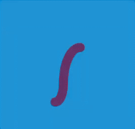

- Bezier

  - For Zdog

    ```javascript
    new Zdog.Shape({
      addTo: illo,
      path: [
        { x: -60, y: -60 },   // start
        { bezier: [
          { x:  20, y: -60 }, // start control point
          { x:  20, y:  60 }, // end control point
          { x:  60, y:  60 }, // end point
        ]},
      ],
      closed: false,
      stroke: 20,
      color: '#636'
    });
    ```

  - For AndroidZdog

    ```kotlin
    shape {
        addTo = illo
        path(
            move(x = -60f, y = -60f),		// start
            bezier(
                vector(x = 20f, y = -60f),	// start control point
                vector(x = 20f, y = 60f),	// end control point
                vector(x = 60f, y = 60f)	// end point
            )
        )
        closed = false
        stroke = 20f
        color = "#636"
    }
    ```

  - Shapes

    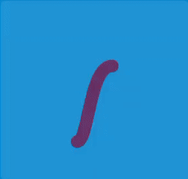

- Closed

  - For Zdog

    ```javascript
    // Closed
    new Zdog.Shape({
      addTo: illo,
      path: [ // triangle
        { x:   0, y: -40 },
        { x:  40, y:  40 },
        { x: -40, y:  40 },
      ],
      // closed by default
      stroke: 20,
      color: '#636'
    });
    ```

    ```javascript
    // Unclosed
    new Zdog.Shape({
      addTo: illo,
      path: [
        { x:   0, y: -40 },
        { x:  40, y:  40 },
        { x: -40, y:  40 },
      ],
      closed: false, // unclosed
      stroke: 20,
      color: '#636'
    });
    ```

  - For AndroidZdog

    ```kotlin
    // Closed
    shape {
        addTo = illo
        path( // triangle
            move(x = 0f, y = -40f),
            line(x = 40f, y = 40f),
            line(x = -40f, y = 40f)
        )
        // closed by default
        stroke = 20f
        color = "#636"
    }
    ```

    ```kotlin
    // Unclosed
    shape {
        addTo = illo
        path( // triangle
            move(x = 0f, y = -40f),
            line(x = 40f, y = 40f),
            line(x = -40f, y = 40f)
        )
        closed = false // unclosed
        stroke = 20f
        color = "#636"
    }
    ```

  - Shapes

    |            Closed             |            Unclosed             |
    | :---------------------------: | :-----------------------------: |
    | 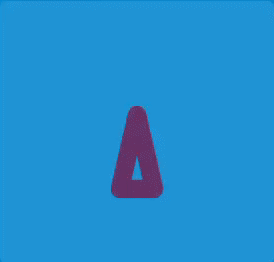 |  |

    

- Hemisphere

  - For Zdog

    ```javascript
    let dome = new Zdog.Hemisphere({
      addTo: illo,
      diameter: 120,
      // fill enabled by default
      // disable stroke for crisp edge
      stroke: false,
      color: '#C25',
      backface: '#EA0',
    });
    ```

  - For AndroidZdog

    ```kotlin
    val demo = hemisphere {
        addTo = illo
        diameter = 120f
        // fill enabled by default
      	// disable stroke for crisp edge
        stroke = 0f // zero for no stroke
        color = "#C25"
        backface = "#EA0"
    }
    ```

  - Shapes

    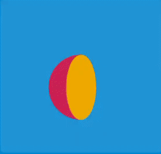

- Cone

  - For Zdog

    ```javascript
    let partyHat = new Zdog.Cone({
      addTo: illo,
      diameter: 70,
      length: 90,
      stroke: false,
      color: '#636',
      backface: '#C25',
    });
    ```

  - For AndroidZdog

    ```kotlin
    val partyHat = cone {
        addTo = illo
        diameter = 70f
        length = 90f
        stroke = 0f // zero for no stroke
        color = "#636"
        backface = "#C25"
    }
    ```

  - Shapes

    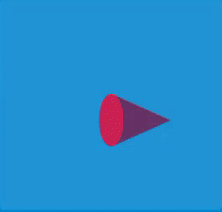

- Cylinder

  - For Zdog

    ```javascript
    let can = new Zdog.Cylinder({
      addTo: illo,
      diameter: 80,
      length: 120,
      stroke: false,
      color: '#C25',
      frontFace: '#EA0',
      backface: '#636',
    });
    ```

  - For AndroidZdog

    ```kotlin
    val can = cylinder {
        addTo = illo
        diameter = 80f
        length = 120f
        stroke = 0f // zero for no stroke
        color = "#C25"
        frontFace = "#EA0"
        backface = "#636"
    }
    ```

  - Shapes

    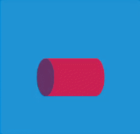

- Box

  - For Zdog

    ```javascript
    let box = new Zdog.Box({
      addTo: illo,
      width: 120,
      height: 100,
      depth: 80,
      stroke: false,
      color: '#C25', // default face color
      leftFace: '#EA0',
      rightFace: '#E62',
      topFace: '#ED0',
      bottomFace: '#636',
    });
    ```

  - For AndroidZdog

    ```kotlin
    val box = box {
        addTo = illo
        width = 120f
        height = 100f
        depth = 80f
        stroke = 0f
        color = "#C25" // default face color
        leftFace = "#EA0"
        rightFace = "#E62"
        topFace = "#ED0"
        bottomFace = "#636"
    }
    ```

  - Shapes

    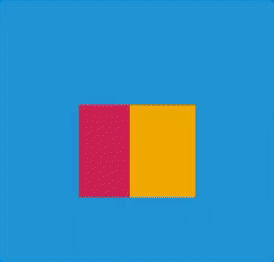

- Z-fighting

  - For Zdog

    ```javascript
    const distance = 40;
    
    let dot = new Zdog.Shape({
      addTo: illo,
      translate: { y: -distance },
      stroke: 80,
      color: '#636',
    });
    dot.copy({
      translate: { x: -distance },
      color: '#EA0',
    });
    dot.copy({
      translate: { z: distance },
      color: '#C25',
    });
    dot.copy({
      translate: { x: distance },
      color: '#E62',
    });
    dot.copy({
      translate: { z: -distance },
      color: '#C25',
    });
    dot.copy({
      translate: { y: distance },
    });
    ```

  - For AndroidZdog

    ```kotlin
    val distance = 40f
    
    val dot = shape {
        addTo = illo
        translate(y = -distance)
        stroke = 80f
        color = "#636"
    }
    dot.copy {
        translate(x = -distance)
        color = "#EA0"
    }
    dot.copy {
        translate(z = distance)
        color = "#C25"
    }
    dot.copy {
        translate(x = distance)
        color = "#E62"
    }
    dot.copy {
        translate(z = -distance)
        color = "#C25"
    }
    dot.copy {
        translate(y = distance)
    }
    ```

  - Shapes

    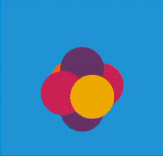

#### Display shapes in ImageView

It's very simple to display Shapes in ImageView. You just need to create shapes, add shapes to ZdogDrawable, and then call the setImageDrawable method of ImageView to display ZdogDrawable.

```kotlin
// Attach shapes to ZdogDrawable and set animations
val drawable = ZdogDrawable().apply { 
    // Create a shape 
    shape {
        addTo = illo // add to ZdogDrawable
        path(
            move(x = -32f, y = -40f),
            line(x = 32f, y = -40f),
            line(x = -32f, y = 40f),
            line(x = 32f, y = 40f)
        )
        closed = false
        stroke = 20f
        color = "#636"
    }
    // Set animations, rotate the Illustration
    play(illo.rotateTo(y = TAU.toFloat()).duration(3000).repeat())
}

// Attach ZdogDrawable to ImageView
imageView.setImageDrawable(drawable)

// Start animation
drawable.start()
```

Final display effect:


## Extended features

We can also use the powerful features of Android Canvas to achieve some cool effects that can't be achieved in Zdog. Here I extend the following features. Through the combination of these features, you can achieve many cool effects.

#### Segment

It allows shapes to display only part of the image.

```kotlin
ZdogDrawable().apply {
    illo.alpha(0f) // Set background transparent
    val line = shape { // Create a shape
        addTo = illo // Add to drawable
        path(
            move(x = -32f, y = -40f),
            line(x = 32f, y = -40f),
            line(x = -32f, y = 40f),
            line(x = 32f, y = 40f)
        )
        closed = false
        stroke = 20f
        color = "#636"
        updateSegment(0f, 0f) // Set segement 0
    }

    play(line.animate {
        onReset {
            line.updateSegment(0f, 1f) // Set segement 0-1, When the animation ends
        }

        update {
            line.updateSegment(0f, it) // Update segment by fraction
        }
    }.duration(1500).interpolator(FastOutSlowInInterpolator()).toReverse())
}
```

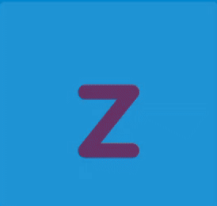

#### Path Effect

It allows lines to be displayed in different effects, such as dashed lines.

```kotlin
ZdogDrawable().apply {
    illo.alpha(0f)
    shape { // A dot at (-90, 0, 0)
        addTo = illo
        path(
            move(-90f),
            line(-90f)
        )
        color = "#FD4"
        stroke = 16f
    }

    shape { // A dot at (90, 0, 0)
        addTo = illo
        path(
            move(90f),
            line(90f)
        )
        color = "#FD4"
        stroke = 16f
    }

    shape { // Create a half circle
        addTo = illo
        path(
            move(-90f, 0f),
            arc(
                vector(-90f, -90f),
                vector(0f, -90f)
            ),
            arc(
                vector(90f, -90f),
                vector(90f, 0f)
            )
        )
        translate { z = -8f }
        color = "#636"
        effect = DashPathEffect(floatArrayOf(20f, 10f), 0f) // Set dotted line effect
        stroke = 4f
        closed = false
    }

    illo.rotate { z = -(TAU / 8).toFloat() }
    play(
        illo.rotateBy(z = (TAU / 4).toFloat()).duration(1500)
            .interpolator(OvershootInterpolator()).toReverse()
    )
}
```

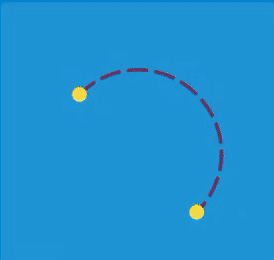

#### Gradient

It can fill shapes with gradient colors.

```kotlin
ZdogDrawable().apply {
    illo.alpha(0f)
    shape {
        addTo = illo
        path(
            move(-90f, 0f),
            arc(
                vector(-90f, 90f),
                vector(0f, 90f)
            ),
            arc(
                vector(90f, 90f),
                vector(90f, 0f)
            )
        )
        // Set a Vertical Linear Gradient from (0, 90) to (0, 0)
        shader = LinearGradient(
            0f, 90f, 0f, 0f,
            "#636".color, Color.TRANSPARENT, Shader.TileMode.CLAMP
        ) 
        fill = true
        stroke = 0f
        closed = false
    }

    illo.rotate { z = (TAU / 8).toFloat() }
    play(
        illo.rotateBy(z = -(TAU / 4).toFloat()).duration(1500)
            .interpolator(OvershootInterpolator()).toReverse()
    )
}
```

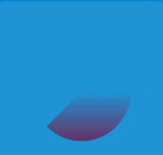

#### Shadow

It adds shadows to shapes.

```kotlin
ZdogDrawable().apply {
    illo.alpha(0f)
    shape {
        addTo = illo
        path(
            move(-90f, 0f),
            arc(
                vector(-90f, 90f),
                vector(0f, 90f)
            ),
            arc(
                vector(90f, 90f),
                vector(90f, 0f)
            )
        )
        color = "#fff"
        // Set a Shader Layer witch radius is 16
        layer = ShaderLayer(
            16f, 0f, 0f,
            Colors.shader.colour
        )
        stroke = 8f
        closed = false
    }

    illo.rotate { z = (TAU / 8).toFloat() }
    play(
        illo.rotateBy(z = -(TAU / 4).toFloat()).duration(1500)
            .interpolator(OvershootInterpolator()).toReverse()
    )
}
```

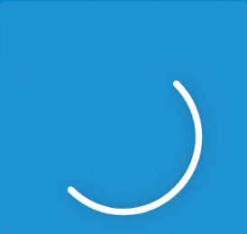

#### Path Animation

It allows the shape to move along a path.

```kotlin
ZdogDrawable().apply {
    illo.alpha(0f)
    val dotted = shape {
        addTo = illo
        path(
            move(-90f, 0f),
            arc(
                vector(-90f, -90f),
                vector(0f, -90f)
            ),
            arc(
                vector(90f, -90f),
                vector(90f, 0f)
            )
        )
        translate { z = -8f }
        color = "#636"
        effect = DashPathEffect(floatArrayOf(20f, 10f), 0f)
        stroke = 4f
        closed = false
    }

    // Get dotted path
    val keyframes =
        PathKeyframes(illo.renderToPath(dotted))
    val xFrames = keyframes.createXFloatKeyframes()
    val yFrames = keyframes.createYFloatKeyframes()

    val dot = shape {
        addTo = illo
        color = "#FD4"
        stroke = 16f

        translate {
            x = xFrames.getFloatValue(0f)
            y = yFrames.getFloatValue(0f)
        }
    }

    play(
        // Let the dot move along the dotted line
        dot.animate {
            onReset {
                dot.translate {
                    x = xFrames.getFloatValue(0f)
                    y = yFrames.getFloatValue(0f)
                }
            }

            update {
                dot.translate {
                    x = xFrames.getFloatValue(it)
                    y = yFrames.getFloatValue(it)
                }
            }
        }.duration(1500).interpolator(FastOutSlowInInterpolator())
            .toReverse()
    )
}
```

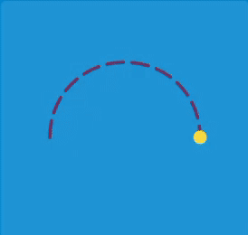

#### Real-time update path

It can update the path to change the shape in animations.

```kotlin
ZdogDrawable().apply {
    illo.alpha(0f)
    val arrow = shape {
        addTo = illo
        path(
            move(-80f, 40f),
            line(0f, -40f),
            line(80f, 40f)
        )
        color = "#fff"
        stroke = 10f
        layer = ShaderLayer(
            16f, 0f, 0f,
            Colors.shader.colour
        )
        closed = false
    }

    // Update the path to change the shape of the arrow
    fun updatePath(shape: Shape, top: Float) {
        shape.apply {
            path[0].point().y = -top
            path[1].point().y = top
            path[2].point().y = -top
        }
    }

    play(arrow.animate {
        onReset {
            updatePath(arrow, 40f)
        }

        update {
            updatePath(arrow, -40f + it * 80f)
        }
    }.duration(1500).toReverse())
}
```


